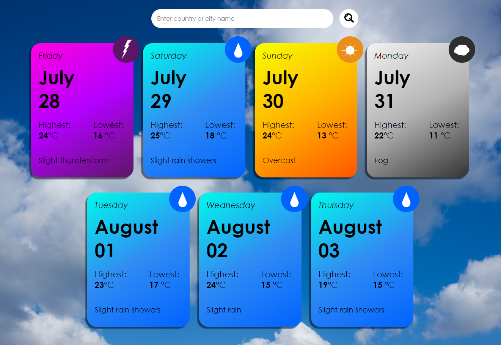

# [My first GitHub Project - Weather app (who would say...)](https://weatherapp-xmavv.netlify.app/)

## Hi! 😛

Thanks for checking out my first project
I made this project because of curiosity, if I am able to do such one
Recently I saw some design of weather cards, and I wanted to do such design on my own, then I thought it also would be nice to code something like this, and there it is!

## Problems and bugs

There might be a lot of problems, especially in my code, I am aware of that, I have just started learning, and so mistakes were made...

I think there would be some problems with funcions in js, and many many divs in html (probably styling in css too)

## Demo video

There will be a video, when I learn how to insert such one

## Features

* Checking weather in typed city

* On hovering You can see more informations, in reference to current hour

## API

* [Open weather](https://openweathermap.org/api/geocoding-api)

* [Open meteo](https://open-meteo.com/)

## More info

You can also check my designs here

* [BEHANCE](https://www.behance.net/mavrgb)
* [IG1](https://www.instagram.com/mavrgb/)
* [IG2](https://www.instagram.com/tfmav/)